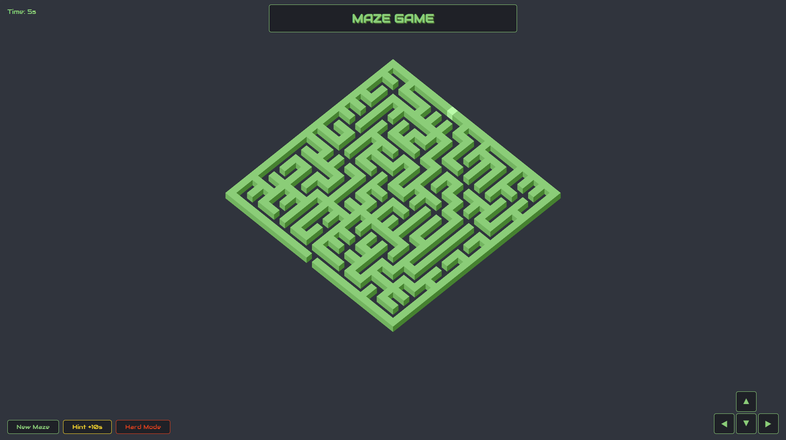

# Isometric Maze Game

A procedurally generated isometric maze game built with vanilla JavaScript and HTML5 Canvas.

---
## Picture



## Features

- Procedural maze generation via **Eller's Algorithm**
- Isometric 3D cube rendering on **HTML5 Canvas**
- Player colour picker, timer, leaderboard & hint system
- **Hard Mode** 
- Mobile D-pad support
- Sound effects & background music

## Controls

`W A S D` or `Arrow Keys` — Move player

## Structure

```
├── index.html
├── css/style.css
├── js/
│   ├── script.js
│   └── audio.js
└── sfx/
    ├── bg.mp3
    ├── move.mp3
    ├── win.mp3
    └── hardmode.mp3
```

## Run it

No build tools needed — just open `index.html` in a browser.

---

## Credits

Made by **Abel Elersič**

Isometric rendering inspired by [Tom Cantwell](https://cantwell-tom.medium.com/isometric-maze-on-html-canvas-c560afb8430a)
